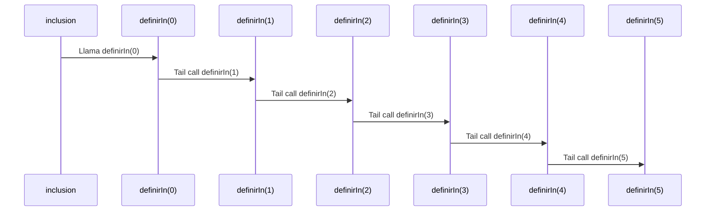

# Informe Taller 2: Funciones de alto orden
## Funcion grande
### Definicion del algoritmo
```Scala
def grande(d: Int, e: Int): ConjuntoDifuso = {
    def define(x: Int): Double = {
      if(x <= 0){
        0.0
      }
      else{
        math.pow(x/(x+d).toDouble,e)
      }
    }
    define
  }
```
- La funcion grande calcula el conjunto difuso de un numero entero
- La funcion recibe dos valores, d y e, estos valores determinan la exigencia
  con la que se evalua el grado de pertenencia de un numero x al conjunto de numeros grandes
  - d: determina el rango en el que los numeros empiezan a considerarse grandes.
  - e: controla que tan rapido sube la pertenencia al conjunto
- La funcion interna define calcula el grado de pertenencia de un numero x al conjunto de numeros grandes
  ### Proceso de funcion grande
- Primero se ingresa el nivel de exigencia para que un numero sea considerado grande
```Scala
 val conjunto1 = grande(10,2)
```
- Con d = 10 y e = 2 el grado de pertenencia de un numero x al conjunto de numeros grandes comenzaria a ser mas alto
  a partir del numero 100
- Ahora se ingresa un numero para calcular su grado de pertenencia
```Scala
 conjunto1(1000)
```
- El numero entra en la funcion interna define y se calcula su grado de pertenencia
```Scala
 math.pow(1000/(1000+10).toDouble,2)
```
- El resultado aproximado seria: 0.98

## Funcion complemento

### Definicion del algoritmo
```Scala
def complemento(c: ConjuntoDifuso): ConjuntoDifuso = {
    def definec(x:Int): Double = {
      1-c(x)
    }
    definec
  }
```
- La funcion complemento calcula el complemento de un conjunto difuso, es decir, lo que le falta al conjunto para ser 1 basicamente
  por ejemplo, si un numero x tiene un grado de pertenencia del 0.60 el complemento seria 0.40
- La funcion recibe un ConjuntoDifuso c y en la funcion interna definec se le resta 1 al conjunto difuso para evaluar el complemento

## Funcion union
```Scala
def union(cd1: ConjuntoDifuso, cd2: ConjuntoDifuso): ConjuntoDifuso = {
    def defineu(x: Int): Double = {
      math.max(cd1(x),cd2(x))
    }
    defineu
  }
```
- Para determinar la union de dos conjuntos difusos se evalua el grado de pertenencia de un numero x en ambos conjuntos
  y la union seria el conjunto de mayor grado de pertenencia

- En la funcion union se reciben dos conjuntos difusos, cd1 y cd2, y en la funcion interna defineu se evalua la union, calculando
  en ambos conjuntos el mismo numero y con math.max se determina el grado de pertenencia mayor

### Ejemplo funcion union
- Primero se ingresan dos conjuntos difusos a la funcion
```Scala
val conjunto1 = grande(10,2)
val conjunto2 = grande(5,2)
val calcularU = union(conjunto1,conjunto2)
```
- Luego se ingresa el numero que se va a evaluar
```Scala
calcularU(1000)
```
- El porcentaje de pertenencia de 1000 en conjunto1 es de 0.98(aproximado) y en conjunto2 es de 0.99(aproximado), entonces la union de ambos conjuntos es 0.99

  ## Funcion interseccion
```Scala
def interseccion(cd1: ConjuntoDifuso, cd2: ConjuntoDifuso): ConjuntoDifuso = {
    def definein(x: Int): Double = {
      math.min(cd1(x),cd2(x))
    }
    definein
  }
```
- Para saber la interseccion de dos conjuntos difusos se calcula el grado de pertenencia menor de un numero x a ambos conjuntos difusos
- La funcion interseccion recibe dos conjuntos difusos, cd1 y cd2, y en la funcion interna definein se evalua un numero x en ambos conjuntos
  y devuelve el conjunto con menor porcentaje de pertenencia

  ## Funcion inclusion

```Scala
def inclusion(cd1: ConjuntoDifuso, cd2: ConjuntoDifuso): Boolean = {
  
  @tailrec
  def definirIn(numero: Int): Boolean = {
    if (numero > 1000) {
      true
    }
    else if (cd1(numero) > cd2(numero)) {
      false
    }
    else {
      definirIn(numero + 1)
    }
    definirIn()
  }

  definirIn(0)
}
```
- La funcion inclusion verifica si un conjunto difuso esta dentro de otro usando recursion de cola y es optimizado con @tailrec
- Debido a que no se pueden evaluar numeros infinitos se evalua hasta el numero 1000, por eso el caso base es numero > 1000
### Proceso de la funcion inclusion

#### Caso base
```Scala
if(numero > 1000)    
```
- Si el numero llega a 1000 significara que el conjunto 1 esta incluido en el conjunto 2
#### Proceso recursivo
- El caso recursivo es:
```Scala
definein(numero+1) 
```
- Sinembargo hay que tener en cuenta que antes de llegar al caso recursivo se hacen un par de evaluaciones:
```Scala
  if(numero > 1000){
  true
  }
  else if(cd1(numero)>cd2(numero)){
  false
  }
```
- Obviamente se evalua si el numero llega al caso base, pero despues de eso se evalua si el grado de pertenencia
  de un numero x en el conjunto1 es mayor al del conjunto2, para que un conjunto este incluido en el otro
  el grado de pertenencia del conjunto1 no deberia ser mayor al conjunto2, por eso la funcion inclusion devuelve
  false si esto se llega a romper
- Si ninguna de las condiciones se cumple se llega al caso recursivo
```Scala
definein(numero+1) 
```
- Se le suma a numero 1 en cada llamada hasta llegar al caso base 1000
### Llamados de pila en recursion de cola

#### Ejemplo de uso

- Debido a que el caso base es muy grande (1000), entonces en este ejemplo se evaluara del 0 al 5
```Scala
val conjunto1 = grande(10,2)
val conjunto2 = grande(5,2)
val vefinclusion = inclusion(conjunto1,conjunto2)
```
#### Paso inicial
```Scala
println(vefinclusion)
```

#### Primera iteracion

```Scala
else if(conjunto1(0)>conjunto2(0)) // Evalua numero (0) en ambos conjuntos
// conjunto1 = 0.0
// conjunto2 = 0.0
// conjunto1 > conjunto 2 = false
definirIn(0+1)
```

#### Segunda iteracion

```Scala
else if(conjunto1(1)>conjunto2(2))
// resultados aproximados  
// conjunto1 = 0.00
// conjunto2 = 0.02
// conjunto1 > conjunto2 = false
definirIn(1+1)
```
#### Tercera iteracion

```Scala
else if(conjunto(2)>conjunto2(2))
//resultados aproximados
// conjunto1 = 0.02
// conjunto2 = 0.08
// conjunto1 > conjunto2 = false
definirIn(2+1)
```

#### Cuarta iteracion

```Scala
else if(conjunto(3)>conjunto2(3))
//resultados aproximados
// conjunto1 = 0.05
// conjunto2 = 0.14
// conjunto1 > conjunto2 = false
definirIn(3+1)
```

#### Quinta iteracion
```Scala
else if(conjunto(4)>conjunto2(4))
//resultados aproximados
// conjunto1 = 0.08
// conjunto2 = 0.19
// conjunto1 > conjunto2 = false
definirIn(4+1)

```
#### Sexta iteracion
```Scala
else if(conjunto(5)>conjunto2(5))
//resultados aproximados
// conjunto1 = 0.11
// conjunto2 = 0.25
// conjunto1 > conjunto2 = false
definirIn(5+1)

```
#### Septima iteracion
```Scala
if(numero > 5){
  true
} // numero = 6 (en esta iteracion)

// println(vefinclusion) = true
```
#### Diagrama de llamado de pila

## Funcion igualdad
### Definicion del algoritmo
```Scala
def igualdad(cd1: ConjuntoDifuso, cd2: ConjuntoDifuso): Boolean = {
  if(inclusion(cd1, cd2) && inclusion(cd2,cd1))true
  else false
}
```
- Para que un conjunto difuso sea igual a otro uno debe estar incluido en el otro y viseversa, por eso para
  saber si son iguales se evalua con la funcion inclusion
